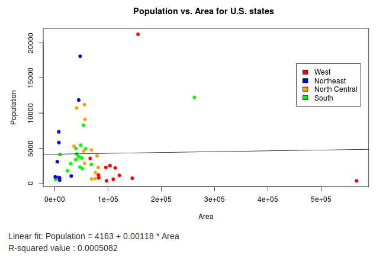

## My app

The app I created was made using Shiny and R.

It can be found here on [shinyapps.io](https://collin.shinyapps.io/ShinyState/).

It produces customizable scatter plots using data for each state in the United States.

---

## Data comes from R dataset 'state'

Data for each state includes eight different categories found in state.x77.

The data is taken from the 1970s, so it is not up-to-date.

``` {r}
head(state.x77,3)

dim(state.x77)
```


--- &twocol

## Widgets
*** =left
Widgets in the sidebar allow you to customize the plot. 

A checkbox toggles whether the state abbreviations are shown next to the corresponding data points.

The variables to be plotted against each other can be selected with the drop-down lists.

A checkbox group determines which regions are shown in the plot (West, Northeast, North Central, South)

*** =right


--- 

## The plot


The scatter plot will show the data for x and y that have been selected and only for the regions selected.
A regression line is added to the plot to show the line of best fit. The equation for this line and its R-squared value is shown below the plot.


